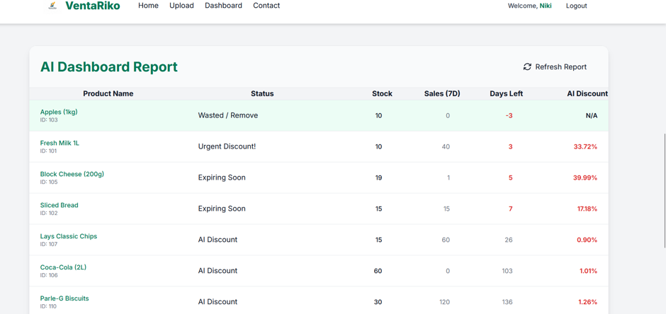
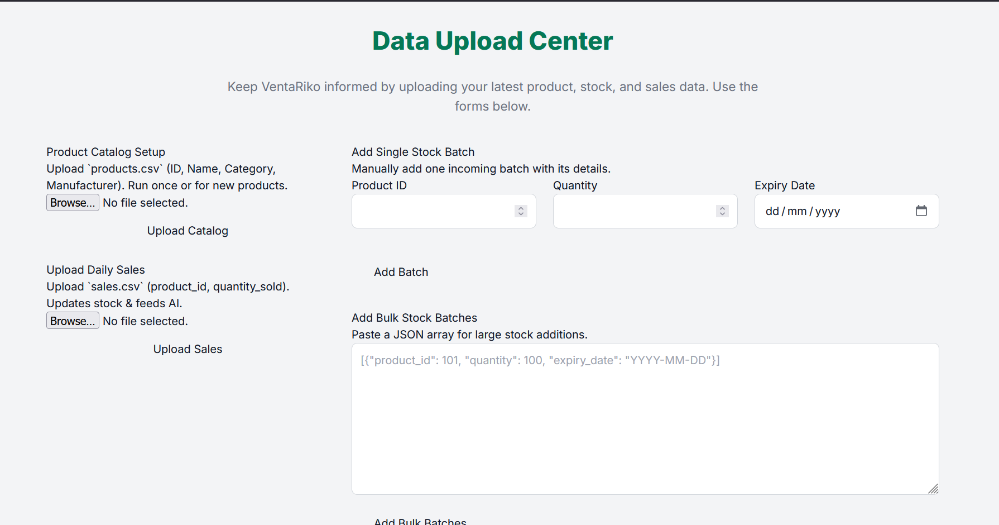

# VentaRiko – AI-Driven Retail Inventory Optimization

VentaRiko is an AI-driven retail inventory optimization system designed to help store managers identify products that may require markdowns and generate dynamic discount recommendations.

The application combines **FastAPI, JWT authentication, SQLAlchemy, SQLite, data ingestion, feature engineering, and a Random Forest regression model** to transform inventory and recent sales information into actionable discount recommendations through a web dashboard.

> **Project Status:** Portfolio / prototype project. The current machine-learning model is trained using synthetic retail data and demonstrates an end-to-end AI-powered inventory decision-support workflow.

---

## Application Screenshots

### AI Dashboard

The AI Dashboard presents inventory status, recent sales activity, remaining shelf life, and machine-learning-generated discount recommendations.



### Data Upload Center

The Data Upload Center allows users to upload product catalogs, daily sales data, and add inventory batches individually or in bulk.



### Authentication

VentaRiko uses JWT-based authentication to provide protected access to the application workflow.


---

## Problem

Retail businesses need to manage inventory efficiently, particularly for products with limited shelf life.

When inventory levels are high and products are approaching expiration, store managers may need to decide:

* Which products require immediate attention
* Which products should receive a discount
* How much discount should be considered
* Which products are approaching their shelf-life limit
* How recent sales activity should influence the recommendation

Making these decisions manually becomes more difficult as the number of products and transactions increases.

VentaRiko addresses this problem by combining inventory and sales signals with machine-learning-based discount recommendations.

---

## Solution

VentaRiko provides an end-to-end workflow for AI-assisted inventory decision support.

```text
User
 │
 ▼
JWT Authentication
 │
 ▼
Inventory & Sales Data
 │
 ▼
FastAPI REST API
 │
 ▼
SQLite + SQLAlchemy
 │
 ▼
Feature Preparation
 │
 ▼
Random Forest Regression
 │
 ▼
Discount Recommendation
 │
 ▼
Dashboard
```

The system predicts a recommended discount percentage based on available inventory and recent sales information.

---

## Key Features

### AI-Based Discount Recommendation

A **Random Forest Regressor** predicts a continuous discount percentage rather than making a simple yes/no decision.

### Inventory Management

The backend supports adding individual inventory batches as well as bulk inventory data.

### Sales Data Ingestion

Daily sales information can be uploaded and used as part of the inventory optimization workflow.

### JWT Authentication

Users can register and authenticate through JWT-based authentication before accessing protected application functionality.

### User-Level Data Isolation

Inventory and sales records are associated with authenticated users, allowing the application to retrieve data relevant to the current user.

### Inventory Status Detection

The dashboard identifies products requiring attention based on their remaining shelf life and inventory conditions.

### AI Dashboard

The frontend presents:

* Product name
* Inventory status
* Available stock
* Recent sales
* Remaining days
* AI-recommended discount

---

## How It Works

### 1. User Authentication

Users register and authenticate through the FastAPI backend.

A successful login provides a JWT token that is used to access protected endpoints.

### 2. Inventory Ingestion

Inventory information can be entered or uploaded through the backend.

### 3. Sales Ingestion

Recent sales information is uploaded through the sales API.

### 4. Feature Preparation

The system prepares the inventory and sales features required by the machine-learning model.

### 5. ML Prediction

The Random Forest regression model predicts a recommended discount percentage.

### 6. Recommendation

The predicted discount is constrained to the application's supported range of **0%–50%**.

### 7. Dashboard

The resulting inventory status and discount recommendations are displayed through the web dashboard.

---

## Machine Learning

### Model

VentaRiko uses a:

**Random Forest Regressor**

The model performs a regression task where the output is a recommended discount percentage.

### Input Features

The prediction pipeline uses:

| Feature           | Description           |
| ----------------- | --------------------- |
| `Category`        | Product category      |
| `Days_Left`       | Remaining shelf life  |
| `Stock_Available` | Available inventory   |
| `Sales_Last_Week` | Recent sales activity |

### Target

The model predicts:

```text
Target_Discount
```

The resulting recommendation is constrained between:

```text
0% – 50%
```

---

## Machine Learning Pipeline

```text
Synthetic Retail Dataset
          │
          ▼
    Data Preparation
          │
          ▼
    Feature Engineering
          │
          ▼
     Train / Test Split
          │
          ▼
 Random Forest Regressor
          │
          ▼
    Model Evaluation
          │
          ▼
     Saved ML Model
          │
          ▼
      FastAPI Backend
          │
          ▼
 Discount Recommendation
          │
          ▼
        Dashboard
```

---

## Training Dataset

The included training workflow uses a **synthetic supermarket dataset**.

The dataset contains retail inventory and sales-related information used to demonstrate the machine-learning pipeline.

The synthetic target incorporates inventory-related conditions such as:

* Remaining shelf life
* Product category characteristics
* Available stock
* Recent sales activity
* Stock-to-sales relationships

Because the dataset is synthetic, model performance should not be interpreted as evidence of production-level retail pricing performance.

---

## Model Training

The repository contains scripts for generating the training dataset and training the model.

### Generate the dataset

```bash
python generatedata_v3.py
```

### Train the model

```bash
python training_v3.py
```

The training pipeline uses a train/test split and evaluates the regression model using **Root Mean Squared Error (RMSE)**.

The trained model is serialized for use by the FastAPI application.

---

## Example Dashboard Output

The dashboard can produce recommendations such as:

| Product      | Status          | Stock | Sales (7D) | Days Left |       AI Discount |
| ------------ | --------------- | ----: | ---------: | --------: | ----------------: |
| Apples       | Wasted / Remove |     — |          — |  Negative |                 — |
| Fresh Milk   | Urgent Discount |     — |          — |       Low | AI Recommendation |
| Block Cheese | Expiring Soon   |     — |          — |       Low | AI Recommendation |
| Sliced Bread | Expiring Soon   |     — |          — |       Low | AI Recommendation |
| Lays         | AI Discount     |     — |          — |    Higher | AI Recommendation |
| Coca-Cola    | AI Discount     |     — |          — |    Higher | AI Recommendation |

The exact values and recommendations depend on the inventory and sales data provided to the application.

---

## OODA-Inspired Decision Workflow

The application can be viewed through an OODA-inspired workflow.

### Observe

Collect inventory and sales information:

* Available stock
* Remaining shelf life
* Product category
* Recent sales

### Orient

Prepare relevant features and identify inventory conditions that may require attention.

### Decide

Use the Random Forest regression model to generate a recommended discount percentage.

### Act

Present the recommendation through the dashboard so that a store manager can use it as a decision-support signal.

> The OODA terminology describes the application's workflow. The current implementation is an ML-backed decision-support system rather than a fully autonomous agent.

---

## System Architecture

```text
                    ┌────────────────────┐
                    │    Store Manager   │
                    └─────────┬──────────┘
                              │
                              ▼
                    ┌────────────────────┐
                    │    Web Dashboard   │
                    │      HTML / JS     │
                    └─────────┬──────────┘
                              │
                         REST API
                              │
                              ▼
                    ┌────────────────────┐
                    │      FastAPI       │
                    ├────────────────────┤
                    │ JWT Authentication │
                    │ Inventory APIs     │
                    │ Sales APIs         │
                    │ Dashboard API      │
                    └─────────┬──────────┘
                              │
                ┌─────────────┴─────────────┐
                │                           │
                ▼                           ▼
       ┌─────────────────┐        ┌──────────────────┐
       │ SQLite +        │        │ Feature          │
       │ SQLAlchemy      │        │ Preparation      │
       └─────────────────┘        └────────┬─────────┘
                                           │
                                           ▼
                                  ┌──────────────────┐
                                  │ Random Forest    │
                                  │ Regressor        │
                                  └────────┬─────────┘
                                           │
                                           ▼
                                  ┌──────────────────┐
                                  │ Discount         │
                                  │ Recommendation   │
                                  └────────┬─────────┘
                                           │
                                           ▼
                                  ┌──────────────────┐
                                  │ Dashboard        │
                                  └──────────────────┘
```

---

## API Endpoints

| Endpoint                   | Method | Purpose                                       |
| -------------------------- | ------ | --------------------------------------------- |
| `/register/`               | POST   | Register a new user                           |
| `/token`                   | POST   | Authenticate and obtain JWT token             |
| `/users/me/`               | GET    | Retrieve authenticated user information       |
| `/setup/upload-inventory/` | POST   | Upload inventory data                         |
| `/stock/add_batch/`        | POST   | Add an inventory batch                        |
| `/stock/add_batch_bulk/`   | POST   | Add multiple inventory batches                |
| `/sales/upload-daily/`     | POST   | Upload daily sales data                       |
| `/dashboard/`              | GET    | Generate the inventory optimization dashboard |

---

## Authentication Flow

```text
User Registration
       │
       ▼
Password Hashing
       │
       ▼
User Login
       │
       ▼
JWT Token
       │
       ▼
Authorization Header
       │
       ▼
Protected API Endpoints
```

The application uses JWT-based authentication for protected backend functionality.

Passwords are handled using password hashing rather than storing plaintext passwords.

---

## Database

VentaRiko uses:

* **SQLite** for local database storage
* **SQLAlchemy** as the ORM

The application contains models representing concepts such as:

* Users
* Products
* Stock batches
* Daily sales logs

Inventory and sales records are associated with users to support user-level data separation.

SQLite is suitable for the current local-development and prototype setup.

For a production deployment, a database such as PostgreSQL would be more appropriate.

---

## Technology Stack

### Programming

* Python
* JavaScript
* HTML
* CSS

### Backend

* FastAPI
* Uvicorn
* REST APIs
* SQLAlchemy

### Authentication

* JWT
* Python-JOSE
* Passlib
* bcrypt

### Machine Learning

* Scikit-learn
* Random Forest Regression
* Pandas
* NumPy
* Joblib

### Data Processing

* Pandas
* NumPy
* CSV data processing
* Faker for synthetic data generation

### Database

* SQLite
* SQLAlchemy ORM

### Frontend

* HTML
* JavaScript
* CSS
* Tailwind CSS

### Development Tools

* Git
* GitHub
* VS Code
* Postman

---

## Project Structure

```text
Venta-Riko-AI-Driven-Retail-Inventory-Optimization/
│
├── main.py
├── database.py
├── models.py
├── schemas.py
│
├── static/
│   ├── css/
│   ├── js/
│   └── images/
│
├── templates/
│
├── screenshots/
│   ├── dashboard.png
│   ├── data-upload.png
│   └── login.png
│
├── model_v3.pkl
├── supermarket_v3.csv
├── generatedata_v3.py
├── training_v3.py
│
├── requirements.txt
├── .gitignore
└── README.md
```

---

## Installation

### 1. Clone the repository

```bash
git clone https://github.com/Shalini2374/Venta-Riko-AI-Driven-Retail-Inventory-Optimization-.git
```

Navigate into the project:

```bash
cd Venta-Riko-AI-Driven-Retail-Inventory-Optimization-
```

### 2. Create a virtual environment

#### Windows

```bash
python -m venv venv
venv\Scripts\activate
```

#### Linux / macOS

```bash
python3 -m venv venv
source venv/bin/activate
```

### 3. Install dependencies

```bash
pip install -r requirements.txt
```

---

## Requirements

The project dependencies are pinned to the versions used in the development environment.

```text
fastapi==0.119.1
uvicorn==0.38.0
SQLAlchemy==2.0.44
pydantic==2.12.3
python-jose==3.5.0
passlib==1.7.4
bcrypt==3.2.0
python-multipart==0.0.20
pandas==2.0.0
numpy==1.24.0
scikit-learn==1.3.0
joblib==1.4.2
Faker==37.11.0
```

---

## Environment Variables

The application uses a secret key for authentication.

For local development, configure it as an environment variable.

Example:

```env
SECRET_KEY=your-secret-key
```

Do not commit real secrets, passwords, API keys, or credentials to GitHub.

---

## Running the Application

Start the FastAPI development server:

```bash
python main.py
```

Alternatively:

```bash
uvicorn main:app --reload
```

The application will run locally at:

```text
http://127.0.0.1:8000
```

FastAPI's automatically generated API documentation is available at:

```text
http://127.0.0.1:8000/docs
```

---

## Using the Application

A typical workflow is:

```text
1. Register a user
        ↓
2. Log in and obtain JWT token
        ↓
3. Upload inventory data
        ↓
4. Upload daily sales data
        ↓
5. Open the dashboard
        ↓
6. Review inventory status
        ↓
7. Review AI-generated discount recommendations
```

---

## Data Flow

```text
Inventory Data
      │
      ▼
FastAPI Upload Endpoint
      │
      ▼
Database
      │
      ├───────────────┐
      │               │
      ▼               ▼
Inventory Data    Sales Data
      │               │
      └───────┬───────┘
              ▼
      Feature Preparation
              │
              ▼
     Random Forest Model
              │
              ▼
   Discount Recommendation
              │
              ▼
          Dashboard
```

---

## Project Evolution

The project evolved through multiple machine-learning approaches.

| Version | Approach                                                            |
| ------- | ------------------------------------------------------------------- |
| **v1**  | Classification-based discount decision                              |
| **v2**  | Regression with inventory and demand-related features               |
| **v3**  | Random Forest regression with a nonlinear synthetic discount target |

The final version focuses on predicting a continuous discount percentage rather than making a binary discount/no-discount decision.

---

## Security

The current application includes:

* JWT-based authentication
* Password hashing
* Protected API endpoints
* User-level data association

For production deployment, additional security measures would be required, including:

* HTTPS
* Secure secret management
* Token expiration and refresh strategies
* Rate limiting
* Strong password policies
* Secure CORS configuration
* Input validation
* Production-grade database configuration
* Centralized logging and monitoring

---

## Limitations

The current version has several limitations:

* The training dataset is synthetic.
* The model predicts discount recommendations rather than directly optimizing revenue or profit.
* Recommendation quality depends on the quality and completeness of inventory and sales data.
* SQLite is currently used for local development.
* The model has not been validated against a large real-world retail transaction dataset.
* The system is a decision-support prototype rather than a fully autonomous inventory management system.
* Recommendations should be reviewed by a human decision-maker before being applied in a real retail environment.

---

## Future Improvements

Potential improvements include:

* Training on real retail transaction data
* Adding historical demand forecasting
* Incorporating price elasticity
* Adding product profit margins
* Using time-series models for demand prediction
* Adding automated model retraining
* Implementing model monitoring and drift detection
* Migrating from SQLite to PostgreSQL
* Containerizing the application with Docker
* Deploying the FastAPI backend to a cloud platform
* Adding role-based access control
* Adding automated inventory alerts
* Tracking the effectiveness of recommended discounts
* Adding analytics for inventory turnover and markdown performance

---

## What This Project Demonstrates

VentaRiko demonstrates an end-to-end software engineering and machine-learning workflow:

* Building REST APIs using FastAPI
* Implementing JWT authentication
* Working with SQLAlchemy ORM
* Managing relational application data
* Processing CSV and tabular data
* Performing feature preparation
* Training a Random Forest regression model
* Saving and loading machine-learning models
* Integrating an ML model with a backend API
* Building a web-based dashboard
* Implementing user-level data isolation
* Connecting machine-learning predictions to an application workflow
* Designing an AI-assisted decision-support system

---

## Disclaimer

VentaRiko is an educational and portfolio project demonstrating an AI-assisted retail inventory optimization workflow.

The current machine-learning model is trained on synthetic data and has not been validated for production retail pricing decisions.

The recommendations produced by the system should therefore be treated as **decision-support suggestions rather than guaranteed optimal pricing decisions**.

---

## Author

**G. S. Shalini**

Integrated M.Tech – Computer Science and Engineering
VIT Vellore

### GitHub

https://github.com/Shalini2374

### LinkedIn

https://www.linkedin.com/in/shalini-saravanan-8a3519268/

---

## License

This project is licensed under the **MIT License**.
